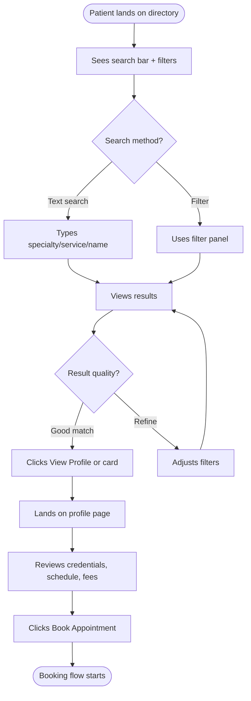
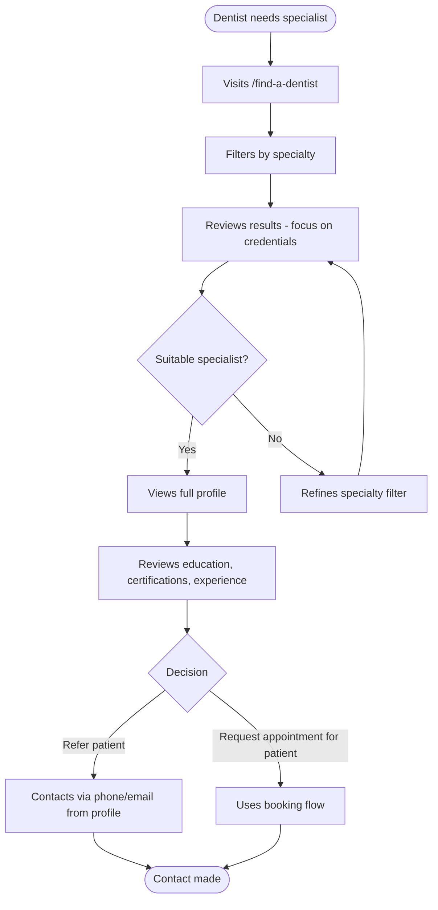
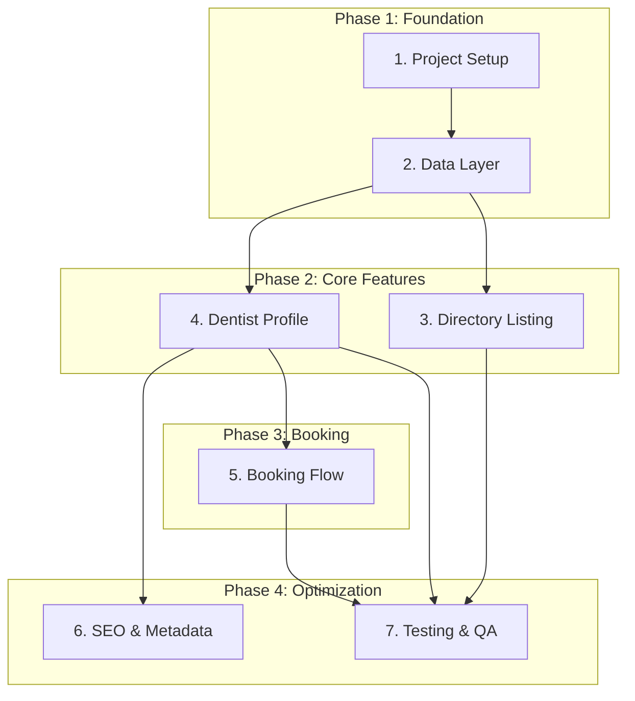
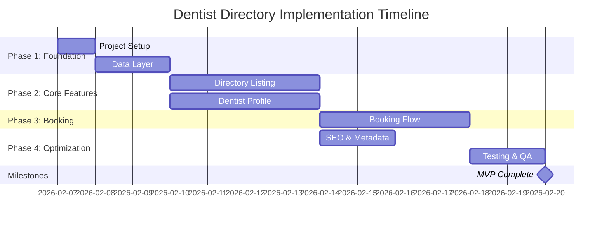

---json
{
  "type": "prd",
  "scope": "large",
  "status": "draft",
  "domain": "frontend",
  "name": "dentist-directory",
  "title": "Dentalemon Dentist Appointment Directory",
  "created": "2026-02-07",
  "updated": "2026-02-07"
}
---

# Morgoth PRD: Dentalemon Dentist Appointment Directory

## Overview

### Problem Statement

**Surface request:** Design a dentist directory within dentalemon.com to help patients discover dentists and request appointments.

**Root problem:** Dentalemon needs a patient acquisition channel and marketplace presence. Currently there's no way for patients to discover dentists through the platform, limiting organic traffic, SEO value, and the two-sided marketplace potential.

**Who's affected:**
- **Patients** seeking dental care who can't find dentists through Dentalemon
- **Dental clinics/practices** missing out on patient acquisition opportunities
- **Referring dentists** who need to find specialists for patient referrals
- **Dentalemon business** missing SEO/organic traffic and marketplace revenue potential

**Impact:** Without a directory:
- Zero patient-side organic traffic to the site
- No marketplace/discovery value proposition
- Limited SEO potential (no indexable dentist profiles)
- Dentists have no incentive to use the platform beyond internal scheduling
- No network effects or two-sided marketplace dynamics

**Evidence:** Reference analysis shows all major healthcare platforms (Zocdoc, Healthgrades, NowServing, TMC) lead with directory/discovery as their primary patient acquisition channel.

### Proposed Solution

Build a comprehensive dentist directory and appointment request system consisting of:

1. **Directory Listing Page** (`/find-a-dentist`) with search, filters, and dentist cards
2. **Dentist Profile Pages** (`/find-a-dentist/[slug]`) with full credentials, bio, schedules, and booking CTA
3. **Appointment Booking Flow** (3-step wizard) for request-based appointment scheduling
4. **Mock API Infrastructure** to support development with sample data
5. **SEO Optimization** with JSON-LD structured data and metadata

**Design Philosophy:**
- Provider-agnostic booking (works with any scheduler, no hard dependencies)
- No PHI/sensitive patient data (legally safe, jurisdiction-neutral)
- Mobile-first, responsive design using Dentalemon brand (amber/yellow theme)
- Request-based appointments (not real-time calendar sync) for maintainability
- Leverages existing Next.js 14 App Router architecture and shadcn/ui components

### Success Criteria

- [ ] SC1: Directory page loads with search bar, filters (specialty, location, services), and dentist listing with list/grid view toggle | AC: Page renders in <2s, all filters functional, toggle persists view preference
- [ ] SC2: Dentist cards display: name, photo, specialty, services, location, availability indicator, booking CTA | AC: All 6 required fields visible on every card, CTA clickable
- [ ] SC3: Dentist profile page displays full profile: credentials, education, certifications, clinic schedules, fees, bio, affiliations, FAQ | AC: All 9 sections present and populated with sample data
- [ ] SC4: Booking flow: 3-step wizard (patient type > appointment details > contact info) functions end-to-end | AC: User can complete all 3 steps, submit request, see confirmation
- [ ] SC5: All pages mobile-responsive at breakpoints: sm (640px), md (768px), lg (1024px) | AC: No horizontal scroll, readable text, tappable CTAs on all breakpoints
- [ ] SC6: No PHI or sensitive patient data stored or displayed | AC: Code review confirms no DOB, health conditions, insurance details, or medical history fields
- [ ] SC7: Disclaimer language present on directory and booking pages | AC: Legal disclaimers visible, clear language about request vs. confirmed appointment
- [ ] SC8: JSON-LD structured data (Dentist schema) on profile pages | AC: Schema validator passes for all profile pages
- [ ] SC9: URL structure supports SEO: `/find-a-dentist`, `/find-a-dentist/[slug]` | AC: URLs indexable, sitemap includes all dentist profiles
- [ ] SC10: Sample data via mock API route `/api/dentists` with 6-8 dentist profiles | AC: API returns valid JSON matching TypeScript interfaces

---

## User Journeys

### Primary Journey 1: Patient Discovers Dentist

**Actor:** Patient seeking dental care
**Goal:** Find a suitable dentist and request an appointment
**Trigger:** User navigates to /find-a-dentist or arrives via SEO/search

#### Journey Flow



#### Stages

| Stage | User Action | System Response | Edge Cases |
|-------|-------------|-----------------|------------|
| 1. Landing | Arrives at /find-a-dentist | Displays search bar, filter panel, initial results (all dentists or popular) | No dentists available → show message "Check back soon" |
| 2. Search | Types query in search bar | Filters results by specialty, service, or dentist name | No matches → show "No results, try different keywords" |
| 3. Filter | Selects specialty, location, services | Updates results list, shows count "X dentists found" | Multiple filters active → show active filter chips |
| 4. Browse | Scrolls through results, toggles list/grid view | Renders cards with dentist info, updates view mode | Slow connection → show skeleton loaders |
| 5. Select | Clicks dentist card or "View Profile" CTA | Navigates to /find-a-dentist/[slug] | Invalid slug → 404 page |
| 6. Review | Reads bio, credentials, schedules | Displays full profile with sidebar CTAs | No available schedule → show "Contact clinic directly" |
| 7. Book | Clicks "Book Appointment" CTA | Opens booking modal/page | User already submitted request → show "Previous request pending" |

#### Edge Cases

| ID | Scenario | Expected Behavior | Priority |
|----|----------|-------------------|----------|
| E1 | No dentists match search/filter criteria | Display "No results found. Try different filters." message with clear filters CTA | P0 |
| E2 | User on slow connection | Show skeleton loaders for cards, graceful progressive loading | P1 |
| E3 | Invalid dentist slug in URL | Redirect to 404 page with "Back to directory" link | P0 |
| E4 | User submits booking request with invalid email | Inline validation error, prevent submission | P0 |
| E5 | User tries to book same dentist twice | Allow (clinics can dedupe), but show notice "You may have already requested" | P2 |
| E6 | Mobile user with filter panel open | Filter panel as drawer/sheet, closes after selection | P0 |
| E7 | User arrives via direct link to profile page | Profile loads correctly, back button goes to directory | P1 |

---

### Primary Journey 2: Referring Dentist Finds Specialist

**Actor:** General dentist referring a patient to a specialist
**Goal:** Find qualified specialist, review credentials, contact for referral
**Trigger:** Dentist needs to refer patient for specialized treatment

#### Journey Flow



---

## Scope Boundaries

### In Scope
- [ ] Directory listing page with search, filters, and results (list + grid view) | AC: Page functional with all features
- [ ] Dentist profile page with full credential display | AC: All 9 profile sections implemented
- [ ] Appointment booking flow (3-step request-based wizard) | AC: Full flow from start to confirmation
- [ ] Mobile-responsive design for all pages | AC: Works on sm, md, lg breakpoints
- [ ] Mock API route with sample dentist data | AC: /api/dentists returns valid JSON
- [ ] JSON-LD structured data for SEO | AC: Schema validation passes
- [ ] Legal disclaimers on directory and booking pages | AC: Disclaimers visible and clear
- [ ] Research documentation for comparable directories | AC: Research findings documented
- [ ] Component architecture aligned with existing shadcn/ui patterns | AC: Uses existing components where possible
- [ ] URL structure for SEO (`/find-a-dentist`, `/find-a-dentist/[slug]`) | AC: URLs indexable

### Out of Scope

| Item | Reason | Status |
|------|--------|--------|
| Final backend implementation | Mock API sufficient for frontend development | Deferred to Phase 2 |
| Real-time calendar sync | Provider-agnostic approach, request-based only | Architectural decision |
| Payment processing | Not needed for appointment requests | Deferred |
| Patient record storage | No PHI, legally safer without | Architectural decision |
| Dentist onboarding/admin portal | Separate workstream | Deferred to Phase 2 |
| Review/rating system | Adds complexity, legal concerns | Deferred to v2 |
| Insurance verification | Complex, jurisdiction-dependent | Deferred to v2 |
| Multi-language support | English only for MVP | Deferred to v2 |
| Email/SMS notifications | Basic confirmation only, no reminders | Deferred to Phase 2 |
| Final scheduling provider integration (Calendly, etc.) | Decision not yet made, architecture supports future integration | Pending decision |

---

## Assumptions

| # | Assumption | Category | Impact if Wrong | Validation | Status |
|---|------------|----------|-----------------|------------|--------|
| A1 | Sample data (6-8 dentist profiles) sufficient for development and demo | Technical | Need more profiles → add to mock API | Test with stakeholders | ✅ |
| A2 | Request-based booking (no real-time sync) acceptable to users | User | Users expect instant confirmation → need real scheduler integration | User testing with booking flow | ⏳ |
| A3 | Public dentist credentials (education, certifications) can be displayed without privacy concerns | Legal | Violation of privacy → remove or require consent | Legal review | ✅ |
| A4 | Dentalemon brand colors (#FFCC5E amber/yellow) work for healthcare directory | Design | Users expect white/blue medical colors → redesign | Design review with stakeholders | ✅ |
| A5 | No authentication required for browsing and booking requests | Business | Spam/abuse → need auth or captcha | Monitor after launch | ⏳ |
| A6 | JSON-LD Dentist schema appropriate for all dental specialties | Technical | Some specialties need different schema → update | SEO audit | ✅ |
| A7 | Existing Next.js 14 App Router architecture supports directory feature | Technical | Performance issues → refactor | Load testing | ⏳ |
| A8 | Contact info (name, phone, email) for booking is NOT PHI under HIPAA/local laws | Legal | Classified as PHI → need consent, encryption | Legal review | ✅ |
| A9 | Mobile-first design appropriate for primary user base | User | Desktop-first users → adjust breakpoints | Analytics review | ✅ |
| A10 | shadcn/ui components sufficient for all UI needs | Technical | Need custom components → build or find alternatives | Component inventory | ✅ |

---

## Discovery

### Skills Required

**Every task references a skill. The implementor MUST load these skills before starting work.**

| Skill | Domain | Used By Tasks | Load Command |
|-------|--------|---------------|--------------|
| (No project-specific skills discovered) | — | — | — |

### Project Resources Identified

- [x] Scan ALL project skills and agents | AC: every `.claude/skills/*/SKILL.md` and `.claude/agents/*.md` read
- [x] Read each relevant skill in full | AC: patterns, conventions, and contracts extracted
- [x] Document applicable resources below | AC: table populated with all relevant resources

| Resource | Type | Path | Relevance |
|----------|------|------|-----------|
| CLAUDE.md | Documentation | `/CLAUDE.md` | Project overview, architecture, development commands, component patterns, styling system |
| PAGE_LAYOUTS.md | Documentation | `/PAGE_LAYOUTS.md` | Layout patterns (landing-style, document-style, product-style, feature-style, download-style) |
| COMPONENT_PATTERNS.md | Documentation | `/COMPONENT_PATTERNS.md` | Reusable patterns: AnimatedShinyText, ShimmerButton, NumberTicker, Scrollytelling, Card Grids |
| config/brand.ts | Configuration | `/config/brand.ts` | Brand configuration: colors (#FFCC5E), fonts (Lora, Inter), company info |
| components.json | Configuration | `/components.json` | shadcn/ui configuration |
| lib/utils.ts | Utility | `/lib/utils.ts` | cn() function for class merging |
| components/ui/* | Components | `/components/ui/` | 47+ shadcn/ui components |

⚠️ **Note:** No project-specific skills found matching this domain. Plan quality depends on manual context from CLAUDE.md and existing documentation.

---

## Functional Requirements

| FR# | Requirement | Priority | MoSCoW | Acceptance Criteria |
|-----|-------------|----------|--------|---------------------|
| FR1 | Directory page with search bar and placeholder text | P0 | Must | Search bar renders with "Search for specialty, service, or dentist name..." placeholder |
| FR2 | Filter panel with specialty, location, services filters | P0 | Must | All 3 filter categories functional, apply to results |
| FR3 | Active filter chips with dismiss functionality | P1 | Should | Chips display when filters active, clicking X removes filter |
| FR4 | Results count display ("X dentists found") | P1 | Should | Count updates dynamically based on search/filters |
| FR5 | List/grid view toggle with state persistence | P1 | Should | Toggle button switches views, preference persists in session |
| FR6 | Dentist cards with 6 required fields (name, photo, specialty, services, location, availability) | P0 | Must | All fields visible on every card, no missing data |
| FR7 | "View Profile" and "Book Appointment" CTAs on cards | P0 | Must | Both CTAs clickable, navigate correctly |
| FR8 | Dentist profile page with 2-column layout (60% main, 40% sidebar) | P0 | Must | Layout renders correctly on desktop |
| FR9 | Profile main column: photo, name, credentials, specialty, experience, bio, schedules, education, certifications | P0 | Must | All 9 sections present and populated |
| FR10 | Profile sidebar: earliest availability card, affiliations, FAQ | P0 | Must | All 3 sidebar sections functional |
| FR11 | Booking flow: 3-step wizard with step indicators | P0 | Must | Steps 1-3 navigable, indicators show progress |
| FR12 | Step 1: Patient type selection (New/Existing) | P0 | Must | Radio buttons or cards for selection |
| FR13 | Step 2: Consultation type, date, time, reason fields | P0 | Must | All fields functional, date picker works |
| FR14 | Step 3: Contact form (name, phone, email) with validation | P0 | Must | Form validates, prevents submission with invalid data |
| FR15 | Booking confirmation message after submission | P0 | Must | Success message displays, clear next steps |
| FR16 | Legal disclaimer on directory page | P0 | Must | Disclaimer visible, explains educational purpose |
| FR17 | Legal disclaimer on booking page | P0 | Must | Disclaimer explains request vs. confirmed appointment |
| FR18 | JSON-LD Dentist schema on profile pages | P0 | Must | Schema validates with Google Structured Data Testing Tool |
| FR19 | Mobile-responsive design (sm, md, lg breakpoints) | P0 | Must | No horizontal scroll, readable, tappable on all sizes |
| FR20 | Mock API route /api/dentists with 6-8 sample profiles | P0 | Must | Returns valid JSON matching TypeScript interfaces |

### Prioritization Summary

**MoSCoW Split:**
- Must: 85% of effort (17 items) — Core directory, profile, booking, legal, SEO
- Should: 15% of effort (3 items) — Filter chips, results count, view toggle

---

## Non-Functional Requirements

### Performance
- **Page Load:** Directory listing page loads in <2s on 3G connection
- **API Response:** /api/dentists responds in <200ms
- **Time to Interactive:** First input delay <100ms on mobile
- **Image Loading:** Dentist photos lazy-loaded, optimized for Next.js Image component

### Bundle Size
- **Page Bundle:** Directory page JS bundle <150KB gzipped
- **Shared Chunks:** Reuse existing shadcn/ui components (already in bundle)

### Browser Support
- Chrome (last 2 versions)
- Firefox (last 2 versions)
- Safari (last 2 versions)
- Edge (last 2 versions)
- Mobile: iOS Safari 14+, Chrome Android 90+

### Accessibility
- **WCAG 2.1 AA Compliance:**
  - Color contrast 4.5:1 minimum for text
  - Keyboard navigation for all interactive elements
  - Screen reader support (semantic HTML, ARIA labels)
  - Focus indicators visible on all inputs/buttons
- **Responsive Touch Targets:** Minimum 44x44px tap targets on mobile

### SEO
- **Metadata:** Unique title, description for each profile page
- **Structured Data:** JSON-LD Dentist schema on all profiles
- **Sitemap:** Include all /find-a-dentist/[slug] URLs
- **Indexability:** No noindex tags, robots.txt allows crawling

---

## Technical Approach

### Architecture Decisions

**AD1: Provider-Agnostic Booking**
**Rationale:** No hard dependency on specific scheduler (Calendly, Acuity, etc.). Request-based approach allows clinics to use any backend scheduler. Future integration can happen via webhook or API without frontend changes.

**AD2: Mock API for Development**
**Rationale:** Frontend development can proceed independently. Mock API (`/api/dentists`) provides realistic data structure. Swap to real backend is trivial (change fetch URL).

**AD3: No PHI Storage**
**Rationale:** Contact info (name, phone, email) for appointment requests is NOT PHI under HIPAA. Avoids legal complexity, no encryption/compliance requirements. Booking = "request" not "patient record."

**AD4: JSON-LD for SEO**
**Rationale:** Structured data improves search result appearance (rich snippets). Dentist schema extends LocalBusiness + MedicalOrganization. Each profile page = unique indexable entity.

**AD5: Existing shadcn/ui Components**
**Rationale:** Project already has 47+ shadcn/ui components installed. Reuse for consistency, reduce bundle size. Custom components only if shadcn/ui insufficient.

---

### Frontend

#### Component Structure

**New Components to Create:**

1. **DentistCard** (`components/directory/DentistCard.tsx`)
   - Props: dentist object, view mode (list/grid)
   - Displays: photo, name, specialty, services, location, availability, CTAs
   - Responsive: stacks vertically on mobile

2. **DentistGrid** (`components/directory/DentistGrid.tsx`)
   - Props: dentists array, view mode
   - Renders: grid or list layout
   - Uses: DentistCard component

3. **SearchBar** (`components/directory/SearchBar.tsx`)
   - Props: onSearch callback, placeholder
   - Features: debounced input, clear button
   - Uses: shadcn/ui Input component

4. **FilterPanel** (`components/directory/FilterPanel.tsx`)
   - Props: filters object, onFilterChange callback
   - Features: specialty, location, services filters
   - Mobile: renders as Sheet (drawer)
   - Desktop: sidebar panel

5. **ActiveFilters** (`components/directory/ActiveFilters.tsx`)
   - Props: active filters, onRemove callback
   - Renders: chip badges with dismiss X
   - Uses: shadcn/ui Badge component

6. **DentistProfile** (`components/directory/DentistProfile.tsx`)
   - Props: dentist object
   - Layout: 2-column (main + sidebar)
   - Sections: header, bio, schedules, education, certifications
   - Uses: shadcn/ui Card, Accordion components

7. **BookingWizard** (`components/directory/BookingWizard.tsx`)
   - State: multi-step form with React Hook Form + Zod
   - Steps: PatientTypeStep, AppointmentDetailsStep, ContactInfoStep
   - Uses: shadcn/ui Form, Button, Input, Select components

8. **LegalDisclaimer** (`components/directory/LegalDisclaimer.tsx`)
   - Props: variant (directory | booking)
   - Renders: appropriate disclaimer text
   - Uses: shadcn/ui Alert component

#### State Management

**Directory Page State:**
```typescript
// app/find-a-dentist/page.tsx
const [searchQuery, setSearchQuery] = useState('')
const [filters, setFilters] = useState({ specialty: [], location: [], services: [] })
const [viewMode, setViewMode] = useState<'list' | 'grid'>('list')
const [dentists, setDentists] = useState([])
```

**Booking Flow State:**
```typescript
// components/directory/BookingWizard.tsx
const [currentStep, setCurrentStep] = useState(1)
const [formData, setFormData] = useState({
  patientType: '',
  consultationType: '',
  preferredDate: '',
  preferredTime: '',
  reason: '',
  name: '',
  phone: '',
  email: ''
})
```

**Data Fetching:**
- Use Next.js App Router server components for initial data
- Client-side filtering for search/filters (no API calls per keystroke)
- Mock API returns all dentists, frontend filters locally

#### UI/UX Considerations

**Design Patterns to Follow:**
- **Glass Morphism:** `bg-background/95 backdrop-blur-sm border-white/10` for cards
- **Brand Gradient:** `brand-gradient-bg` class for hero sections
- **Section Spacing:** `py-20 md:py-32` consistent spacing
- **Container:** `container px-4 md:px-6` for content width
- **Animation:** Framer Motion `fadeInUp`, `staggerContainer`, `viewport={{ once: true }}`

**Responsive Breakpoints:**
- **Mobile (sm: 640px):** Single column, filter panel as drawer, cards stack
- **Tablet (md: 768px):** 2-column grid, filter panel sidebar, cards horizontal
- **Desktop (lg: 1024px):** 3-column grid, full layout, cards vertical

**Accessibility Requirements:**
- All form inputs have labels
- Search bar has aria-label
- Filter checkboxes keyboard navigable
- CTAs have clear text (not just icons)
- Focus visible on all interactive elements
- Screen reader announcements for results count

---

### Backend (Mock API)

#### API Contracts

**GET /api/dentists**
- **Description:** Returns array of all dentist profiles
- **Query Params:** None (filtering happens client-side)
- **Response:** 200 OK
```json
{
  "dentists": [
    {
      "id": "dr-jane-smith",
      "slug": "dr-jane-smith",
      "name": "Dr. Jane Smith",
      "credentials": "DDS, FICOI",
      "specialty": "General Dentistry",
      "subspecialties": ["Cosmetic Dentistry", "Implantology"],
      "experience": 15,
      "photo": "/images/dentists/dr-jane-smith.jpg",
      "bio": "Dr. Smith has been practicing...",
      "education": [
        {
          "degree": "Doctor of Dental Surgery (DDS)",
          "institution": "University of the Philippines Manila",
          "year": 2008
        }
      ],
      "certifications": [
        {
          "name": "Fellow of International Congress of Oral Implantologists (FICOI)",
          "issuer": "ICOI",
          "year": 2015
        }
      ],
      "clinics": [
        {
          "name": "SmileCare Dental Clinic",
          "address": {
            "street": "123 Main St",
            "city": "Makati",
            "province": "Metro Manila",
            "postal": "1200"
          },
          "phone": "+63 2 1234 5678",
          "email": "info@smilecare.ph",
          "schedules": [
            {
              "day": "Monday",
              "slots": [
                { "start": "09:00", "end": "12:00" },
                { "start": "14:00", "end": "18:00" }
              ]
            }
          ],
          "fee": { "min": 1500, "max": 5000, "currency": "PHP" }
        }
      ],
      "services": ["General Checkup", "Teeth Cleaning", "Dental Implants", "Cosmetic Dentistry"],
      "affiliations": ["Philippine Dental Association", "ICOI"],
      "faq": [
        {
          "question": "Do you accept walk-ins?",
          "answer": "We recommend appointments, but accept walk-ins subject to availability."
        }
      ],
      "availability": {
        "earliestDate": "2026-02-10",
        "earliestTime": "09:00"
      }
    }
  ]
}
```

**GET /api/dentists/[id]**
- **Description:** Returns single dentist profile by ID
- **Path Params:** `id` (string, dentist slug)
- **Response:** 200 OK (same dentist object structure)
- **Error:** 404 Not Found if ID invalid

**POST /api/appointments/request**
- **Description:** Submits appointment request (mock, no actual storage)
- **Request Body:**
```json
{
  "dentistId": "dr-jane-smith",
  "patientType": "new",
  "consultationType": "General Checkup",
  "preferredDate": "2026-02-10",
  "preferredTime": "09:00",
  "reason": "Routine checkup",
  "contact": {
    "name": "John Doe",
    "phone": "+63 912 345 6789",
    "email": "john@example.com"
  }
}
```
- **Response:** 200 OK
```json
{
  "success": true,
  "requestId": "REQ-12345",
  "message": "Appointment request submitted. The clinic will contact you within 24 hours."
}
```

#### Data Models

**TypeScript Interfaces:**

```typescript
// types/dentist.ts

export interface Dentist {
  id: string
  slug: string
  name: string
  credentials: string
  specialty: string
  subspecialties?: string[]
  experience: number // years
  photo: string
  bio: string
  education: Education[]
  certifications: Certification[]
  clinics: Clinic[]
  services: string[]
  affiliations: string[]
  faq: FAQ[]
  availability: Availability
}

export interface Education {
  degree: string
  institution: string
  year: number
}

export interface Certification {
  name: string
  issuer: string
  year: number
}

export interface Clinic {
  name: string
  address: Address
  phone: string
  email: string
  schedules: Schedule[]
  fee: Fee
}

export interface Address {
  street: string
  city: string
  province: string
  postal: string
}

export interface Schedule {
  day: string
  slots: TimeSlot[]
}

export interface TimeSlot {
  start: string // HH:mm
  end: string
}

export interface Fee {
  min: number
  max: number
  currency: string
}

export interface FAQ {
  question: string
  answer: string
}

export interface Availability {
  earliestDate: string // ISO date
  earliestTime: string // HH:mm
}

export interface AppointmentRequest {
  dentistId: string
  patientType: 'new' | 'existing'
  consultationType: string
  preferredDate: string
  preferredTime: string
  reason: string
  contact: ContactInfo
}

export interface ContactInfo {
  name: string
  phone: string
  email: string
}
```

---

## Dependencies

### Task Dependencies

| Task | Depends On | Blocks | Type |
|------|------------|--------|------|
| 1. Project Setup | — | 2, 3, 4, 5 | — |
| 2. Data Layer | 1 | 3, 4, 5 | Hard |
| 3. Directory Listing | 1, 2 | — | Hard |
| 4. Dentist Profile | 1, 2 | 5 | Hard |
| 5. Booking Flow | 1, 2, 4 | — | Hard |
| 6. SEO & Metadata | 4 | — | Soft |
| 7. Testing & QA | 3, 4, 5 | — | Hard |

### Dependency Graph



### External Dependencies

| Dependency | Owner | Expected | Fallback | Status |
|------------|-------|----------|----------|--------|
| Sample dentist photos (6-8 headshots) | Design team | Phase 1 | Use placeholder avatars | ⏳ |
| Legal disclaimer copy | Legal team | Phase 1 | Use generic medical disclaimer template | ⏳ |
| Brand guidelines confirmation | Marketing | Phase 1 | Use existing config/brand.ts values | ✅ |

### Critical Path

1. Project Setup (1 day) → 2. Data Layer (2 days) → 4. Dentist Profile (3 days) → 5. Booking Flow (3 days) → 7. Testing (2 days)

**Critical Path Duration:** 11 days minimum

### Parallel Tracks

**Track A (Directory):** Task 1 → Task 2 → Task 3
**Track B (Profile + Booking):** Task 1 → Task 2 → Task 4 → Task 5
**Track C (SEO):** Task 4 → Task 6

**Merge Point:** Task 7 (Testing & QA)

---

## Estimation Summary

| Task | Size | Points | Time Est | Complexity |
|------|------|--------|----------|------------|
| 1. Project Setup | S | 2 | 1 day | 2/12 |
| 2. Data Layer | M | 5 | 2 days | 4/12 |
| 3. Directory Listing | L | 8 | 3-4 days | 7/12 |
| 4. Dentist Profile | L | 8 | 3-4 days | 7/12 |
| 5. Booking Flow | L | 8 | 3-4 days | 8/12 |
| 6. SEO & Metadata | M | 5 | 2 days | 5/12 |
| 7. Testing & QA | M | 5 | 2 days | 6/12 |
| **Total** | — | **41** | **16-21 days** | — |

**Buffer (20% for unknowns):** 4 days
**Total with Buffer:** 20-25 days (4-5 weeks)

### Timeline



---

## Risks

| Risk | Category | Likelihood | Impact | Score | Mitigation | Owner |
|------|----------|------------|--------|-------|------------|-------|
| Legal concerns about displaying dentist credentials | Legal | Low | High | 🔶 | Legal review before launch, ensure only public info displayed | Legal team |
| Users expect instant booking confirmation, not "request" | User | Medium | Medium | 🔶 | Clear disclaimers, messaging explains clinic will follow up | Product |
| Mobile performance issues with large dentist list | Technical | Medium | Medium | 🔶 | Pagination or infinite scroll, lazy loading, optimize images | Dev team |
| Dentist photos not available in time | Resource | Medium | Low | 🟢 | Use placeholder avatars, add photos later via content update | Design team |
| Search/filter UX confusing to users | User | Low | Medium | 🟢 | User testing during development, iterate based on feedback | Product/Design |
| JSON-LD schema validation fails | Technical | Low | Medium | 🟢 | Use schema.org validator during development, test early | Dev team |
| Accessibility issues on mobile (touch targets) | Technical | Medium | Medium | 🔶 | Accessibility audit during QA, manual testing on devices | QA/Dev |
| Spam submissions via booking form | Security | Medium | Low | 🟢 | Add honeypot field, rate limiting, consider captcha in Phase 2 | Dev team |

---

## Implementation Checklist

### Phase 1: Foundation | AC: Project structure created, types defined, mock API functional | Est: M (3 days)

#### Task 1.1: Project Setup | AC: Directories created, dependencies installed | Est: S

- [ ] 1.1.1: Create directory structure `app/find-a-dentist/`, `components/directory/`, `types/`, `data/dentists/` | AC: Folders exist, no errors
- [ ] 1.1.2: Verify existing shadcn/ui components (Card, Button, Input, Select, Sheet, Accordion, Badge, Alert, Form) installed | AC: All 9 components present in `components/ui/`
- [ ] 1.1.3: Install additional dependencies if needed (react-hook-form, zod already in package.json) | AC: `npm install` runs successfully
- [ ] 1.1.4: Create `types/dentist.ts` with all TypeScript interfaces | AC: File compiles without errors, exports all types

#### Task 1.2: Mock Data & API | AC: Mock API returns valid JSON, 6-8 sample profiles created | Est: M

- [ ] 1.2.1: Create `data/dentists/sample-dentists.ts` with 6-8 dentist profile objects | AC: Data matches Dentist interface, no type errors
  - Sample dentists: General Dentistry, Orthodontics, Periodontics, Endodontics, Oral Surgery, Cosmetic Dentistry (minimum 6)
  - Include diverse: experience levels (5-20 years), locations (Makati, BGC, Quezon City, etc.), fee ranges (1000-10000 PHP)

- [ ] 1.2.2: Create API route `app/api/dentists/route.ts` with GET handler | AC: Returns { dentists: [...] } with 200 status
- [ ] 1.2.3: Create API route `app/api/dentists/[id]/route.ts` with GET handler | AC: Returns single dentist or 404
- [ ] 1.2.4: Create API route `app/api/appointments/request/route.ts` with POST handler | AC: Returns { success: true, requestId, message }
- [ ] 1.2.5: Test all API routes with curl or Postman | AC: All endpoints return expected JSON

---

### Phase 2: Directory Listing Page | AC: /find-a-dentist page functional with search, filters, results | Est: L (3-4 days)

#### Task 2.1: Search Bar Component | AC: Search filters results by specialty/service/name | Est: S

- [ ] 2.1.1: Create `components/directory/SearchBar.tsx` with Input from shadcn/ui | AC: Component renders with placeholder text
- [ ] 2.1.2: Implement debounced search (300ms delay) using `useDebouncedCallback` or `useEffect` | AC: onSearch callback fires 300ms after user stops typing
- [ ] 2.1.3: Add clear button (X icon) that resets search | AC: Clicking X clears input and fires onSearch('')
- [ ] 2.1.4: Style with Dentalemon brand (amber focus ring) | AC: Focus state shows #FFCC5E border

#### Task 2.2: Filter Panel Component | AC: Filters update results, mobile renders as drawer | Est: M

- [ ] 2.2.1: Create `components/directory/FilterPanel.tsx` with Checkbox groups | AC: Component renders 3 sections (specialty, location, services)
- [ ] 2.2.2: Implement specialty filter (8 dental specialties from data) | AC: Checkboxes toggle, onFilterChange fires with updated array
- [ ] 2.2.3: Implement location filter (cities from dentist data) | AC: Checkboxes toggle, onFilterChange fires
- [ ] 2.2.4: Implement services filter (services from dentist data) | AC: Checkboxes toggle, onFilterChange fires
- [ ] 2.2.5: Add "Clear All Filters" button | AC: Button resets all checkboxes, fires onFilterChange with empty arrays
- [ ] 2.2.6: Responsive: render as Sheet (drawer) on mobile (<768px), sidebar on desktop | AC: Drawer opens/closes on mobile, sidebar visible on desktop

#### Task 2.3: Active Filters Component | AC: Chips display, clicking X removes filter | Est: S

- [ ] 2.3.1: Create `components/directory/ActiveFilters.tsx` with Badge components | AC: Component renders chips for each active filter
- [ ] 2.3.2: Implement dismiss handler (clicking X removes filter) | AC: onRemove callback fires with filter key/value
- [ ] 2.3.3: Style chips with amber accent | AC: Chips use brand color, hover state visible

#### Task 2.4: Dentist Card Component | AC: Card displays 6 required fields, CTAs work | Est: M

- [ ] 2.4.1: Create `components/directory/DentistCard.tsx` with Card from shadcn/ui | AC: Component renders with all props
- [ ] 2.4.2: Implement list view layout (horizontal, image left, info right) | AC: Card displays horizontally with proper spacing
- [ ] 2.4.3: Implement grid view layout (vertical, image top, info below) | AC: Card displays vertically, responsive
- [ ] 2.4.4: Add "View Profile" and "Book Appointment" buttons | AC: Both buttons link correctly (View Profile → /find-a-dentist/[slug], Book → booking modal)
- [ ] 2.4.5: Display availability indicator (green dot + "Available" or grey + "Contact clinic") | AC: Indicator shows based on availability.earliestDate
- [ ] 2.4.6: Add hover animation (lift effect) using Framer Motion | AC: Card lifts slightly on hover, smooth transition

#### Task 2.5: Dentist Grid Component | AC: Renders list/grid view, responsive | Est: S

- [ ] 2.5.1: Create `components/directory/DentistGrid.tsx` that maps dentists array to DentistCard | AC: All dentists render
- [ ] 2.5.2: Implement grid layout (3 columns desktop, 2 tablet, 1 mobile) | AC: Responsive grid using Tailwind grid classes
- [ ] 2.5.3: Implement list layout (single column, full width) | AC: List view stacks cards vertically
- [ ] 2.5.4: Add stagger animation on initial load | AC: Cards fade in with stagger using Framer Motion

#### Task 2.6: Directory Page | AC: /find-a-dentist page fully functional | Est: M

- [ ] 2.6.1: Create `app/find-a-dentist/page.tsx` with server component for initial data fetch | AC: Page pre-renders with dentists data
- [ ] 2.6.2: Implement search state and filter logic (client component) | AC: Search and filters update results array
- [ ] 2.6.3: Add results count ("X dentists found") | AC: Count updates dynamically
- [ ] 2.6.4: Add list/grid view toggle button | AC: Toggle switches viewMode state
- [ ] 2.6.5: Integrate SearchBar, FilterPanel, ActiveFilters, DentistGrid components | AC: All components render and interact correctly
- [ ] 2.6.6: Add LegalDisclaimer component at top of page | AC: Disclaimer visible with correct text
- [ ] 2.6.7: Style page with section spacing (py-20 md:py-32) and container | AC: Page matches brand spacing patterns
- [ ] 2.6.8: Add Framer Motion page transition animation | AC: Page fades in on mount

#### **GATE: Directory Page Tests** (REQUIRED) | AC: all tests pass

- [ ] Write component tests for SearchBar (search input, debounce, clear) | AC: All interactions tested, tests pass
- [ ] Write component tests for FilterPanel (checkbox toggle, clear all) | AC: Filter logic tested, tests pass
- [ ] Write component tests for DentistCard (render fields, CTA links) | AC: Card rendering tested, tests pass
- [ ] Write integration test for directory page (search + filter + results) | AC: Full flow tested, tests pass
- [ ] Run tests: `npm run test` | AC: exit code 0, no failures
- [ ] Verify ALL tests pass | AC: test report shows 0 failures

**DO NOT PROCEED TO PHASE 3 UNTIL ALL DIRECTORY TESTS PASS**

---

### Phase 3: Dentist Profile Page | AC: /find-a-dentist/[slug] page displays full profile | Est: L (3-4 days)

#### Task 3.1: Profile Header Component | AC: Header shows photo, name, credentials, specialty | Est: S

- [ ] 3.1.1: Create `components/directory/profile/ProfileHeader.tsx` | AC: Component renders with dentist props
- [ ] 3.1.2: Display dentist photo (Next.js Image, optimized) | AC: Image loads, alt text present
- [ ] 3.1.3: Display name and credentials (h1 + span) | AC: Typography uses Lora font, proper hierarchy
- [ ] 3.1.4: Display specialty and subspecialties (badges) | AC: Specialty as primary badge, subspecialties as secondary
- [ ] 3.1.5: Display experience ("15 years of experience") | AC: Text calculates correctly from experience field
- [ ] 3.1.6: Add availability indicator ("Available for booking" or "Contact clinic") | AC: Indicator based on availability.earliestDate

#### Task 3.2: Profile Bio Section | AC: Bio displays with "Read More" expand | Est: S

- [ ] 3.2.1: Create `components/directory/profile/ProfileBio.tsx` | AC: Component renders bio text
- [ ] 3.2.2: Implement truncated bio (show first 200 chars) | AC: Long bios truncate with "..."
- [ ] 3.2.3: Add "Read More" button that expands full bio | AC: Button toggles between truncated/full text
- [ ] 3.2.4: Style with proper typography (Inter font, line-height) | AC: Readable text formatting

#### Task 3.3: Clinic Schedules Section | AC: Multiple clinics displayed with schedules and fees | Est: M

- [ ] 3.3.1: Create `components/directory/profile/ClinicSchedules.tsx` | AC: Component renders clinics array
- [ ] 3.3.2: Display clinic name and address | AC: Full address formatted (street, city, province, postal)
- [ ] 3.3.3: Display contact info (phone, email) | AC: Phone as tel: link, email as mailto: link
- [ ] 3.3.4: Display weekly schedule in table format | AC: Days as rows, time slots as columns
- [ ] 3.3.5: Display fee range (min-max, currency) | AC: "₱1,500 - ₱5,000" format
- [ ] 3.3.6: Add "Book Here" CTA button for each clinic | AC: Button opens booking modal with clinic pre-selected

#### Task 3.4: Education & Certifications Section | AC: Credentials displayed in timeline format | Est: S

- [ ] 3.4.1: Create `components/directory/profile/EducationCertifications.tsx` | AC: Component renders both arrays
- [ ] 3.4.2: Display education (degree, institution, year) in timeline | AC: Each entry shows degree → institution (year)
- [ ] 3.4.3: Display certifications (name, issuer, year) in timeline | AC: Each entry shows cert → issuer (year)
- [ ] 3.4.4: Add icons for education (graduation cap) and certifications (award) | AC: lucide-react icons used

#### Task 3.5: Sidebar Components | AC: Sidebar shows earliest availability, affiliations, FAQ | Est: M

- [ ] 3.5.1: Create `components/directory/profile/EarliestAvailability.tsx` | AC: Card displays date, time, clinic, fee
- [ ] 3.5.2: Add "Book Appointment" CTA in availability card | AC: Button opens booking modal
- [ ] 3.5.3: Create `components/directory/profile/Affiliations.tsx` | AC: List of affiliations with badges
- [ ] 3.5.4: Create `components/directory/profile/FAQ.tsx` using Accordion | AC: FAQ questions expand/collapse
- [ ] 3.5.5: Style sidebar components with consistent spacing | AC: Cards use same padding, gap between sections

#### Task 3.6: Profile Page Layout | AC: /find-a-dentist/[slug] page fully functional | Est: M

- [ ] 3.6.1: Create `app/find-a-dentist/[slug]/page.tsx` with dynamic route | AC: Page loads with slug param
- [ ] 3.6.2: Fetch dentist data from API (server component) | AC: Data pre-rendered, 404 if slug invalid
- [ ] 3.6.3: Implement 2-column layout (60% main, 40% sidebar) on desktop | AC: Columns responsive, stack on mobile
- [ ] 3.6.4: Integrate ProfileHeader component | AC: Header renders at top
- [ ] 3.6.5: Integrate ProfileBio, ClinicSchedules, EducationCertifications in main column | AC: All sections render in order
- [ ] 3.6.6: Integrate EarliestAvailability, Affiliations, FAQ in sidebar | AC: Sidebar sticky on scroll (desktop only)
- [ ] 3.6.7: Add LegalDisclaimer at bottom of page | AC: Disclaimer visible
- [ ] 3.6.8: Add breadcrumb navigation (Home > Find a Dentist > [Name]) | AC: Breadcrumbs functional, clickable links
- [ ] 3.6.9: Add Framer Motion page transition | AC: Page fades in on mount

#### **GATE: Profile Page Tests** (REQUIRED) | AC: all tests pass

- [ ] Write component tests for ProfileHeader (render all fields) | AC: All props tested, tests pass
- [ ] Write component tests for ClinicSchedules (multiple clinics, schedule display) | AC: Schedule rendering tested, tests pass
- [ ] Write component tests for FAQ accordion (expand/collapse) | AC: Accordion interaction tested, tests pass
- [ ] Write integration test for profile page (full page render) | AC: Page loads with valid slug, tests pass
- [ ] Run tests: `npm run test` | AC: exit code 0, no failures
- [ ] Verify ALL tests pass | AC: test report shows 0 failures

**DO NOT PROCEED TO PHASE 4 UNTIL ALL PROFILE TESTS PASS**

---

### Phase 4: Booking Flow | AC: 3-step wizard functional, submits request | Est: L (3-4 days)

#### Task 4.1: Booking Wizard Shell | AC: Multi-step form with navigation | Est: M

- [ ] 4.1.1: Create `components/directory/BookingWizard.tsx` with React Hook Form + Zod | AC: Form initialized with validation schema
- [ ] 4.1.2: Implement step state (currentStep 1-3) | AC: State controls which step is visible
- [ ] 4.1.3: Add step indicator component (numbered dots) | AC: Dots show progress, current step highlighted
- [ ] 4.1.4: Add "Next" / "Back" / "Submit" buttons | AC: Buttons navigate steps, Submit only on step 3
- [ ] 4.1.5: Implement form data persistence across steps | AC: Data retained when navigating back/forward
- [ ] 4.1.6: Open wizard in Sheet (mobile) or Dialog (desktop) | AC: Modal opens from "Book Appointment" CTA

#### Task 4.2: Step 1 - Patient Type Selection | AC: User selects New or Existing patient | Est: S

- [ ] 4.2.1: Create `components/directory/booking/PatientTypeStep.tsx` | AC: Component renders selection UI
- [ ] 4.2.2: Implement radio button or card selection UI | AC: One option selected at a time
- [ ] 4.2.3: Validate selection before allowing "Next" | AC: Next button disabled until selection made
- [ ] 4.2.4: Style cards with hover/selected states | AC: Selected card has amber border

#### Task 4.3: Step 2 - Appointment Details | AC: User enters consultation type, date, time, reason | Est: M

- [ ] 4.3.1: Create `components/directory/booking/AppointmentDetailsStep.tsx` | AC: Component renders all fields
- [ ] 4.3.2: Add consultation type Select (dropdown with services from dentist) | AC: Dropdown populated with dentist.services
- [ ] 4.3.3: Add date picker (shadcn/ui Popover + Calendar) | AC: Date picker shows calendar, selects date
- [ ] 4.3.4: Add time slot Select (dropdown with common times) | AC: Times in 30-min increments (09:00, 09:30, etc.)
- [ ] 4.3.5: Add reason Textarea (optional) | AC: Textarea allows multiline input, max 500 chars
- [ ] 4.3.6: Validate required fields before allowing "Next" | AC: Next disabled until type, date, time filled

#### Task 4.4: Step 3 - Contact Information | AC: User enters name, phone, email | Est: M

- [ ] 4.4.1: Create `components/directory/booking/ContactInfoStep.tsx` | AC: Component renders contact form
- [ ] 4.4.2: Add name Input with validation (required, min 2 chars) | AC: Field validates, shows error message
- [ ] 4.4.3: Add phone Input with validation (required, phone format) | AC: Field validates phone pattern (+63 XXX XXX XXXX)
- [ ] 4.4.4: Add email Input with validation (required, email format) | AC: Field validates email pattern
- [ ] 4.4.5: Add consent checkbox ("I agree to be contacted...") | AC: Checkbox required before submit
- [ ] 4.4.6: Validate all fields before enabling "Submit Request" | AC: Submit disabled until all valid

#### Task 4.5: Submission & Confirmation | AC: Form submits, confirmation message displays | Est: S

- [ ] 4.5.1: Implement submit handler in BookingWizard | AC: Handler posts to /api/appointments/request
- [ ] 4.5.2: Show loading state during submission | AC: Submit button shows spinner, disabled
- [ ] 4.5.3: Handle success response (display confirmation) | AC: Success message shows requestId, next steps
- [ ] 4.5.4: Handle error response (display error message) | AC: Error message clear, allows retry
- [ ] 4.5.5: Reset form after successful submission | AC: Form clears, closes modal
- [ ] 4.5.6: Add LegalDisclaimer in wizard (explains request vs. confirmed) | AC: Disclaimer visible on step 1 or step 3

#### **GATE: Booking Flow Tests** (REQUIRED) | AC: all tests pass

- [ ] Write component tests for PatientTypeStep (selection logic) | AC: Selection tested, tests pass
- [ ] Write component tests for AppointmentDetailsStep (field validation) | AC: All validations tested, tests pass
- [ ] Write component tests for ContactInfoStep (phone/email validation) | AC: Validation logic tested, tests pass
- [ ] Write integration test for full booking flow (3 steps → submit) | AC: Complete flow tested, tests pass
- [ ] Write test for form submission success/error handling | AC: Both paths tested, tests pass
- [ ] Run tests: `npm run test` | AC: exit code 0, no failures
- [ ] Verify ALL tests pass | AC: test report shows 0 failures

**DO NOT PROCEED TO PHASE 5 UNTIL ALL BOOKING TESTS PASS**

---

### Phase 5: SEO & Metadata | AC: JSON-LD, metadata, sitemap implemented | Est: M (2 days)

#### Task 5.1: JSON-LD Structured Data | AC: Dentist schema on all profile pages | Est: M

- [ ] 5.1.1: Create `lib/seo/generateDentistSchema.ts` utility function | AC: Function accepts Dentist object, returns JSON-LD
- [ ] 5.1.2: Implement schema.org/Dentist schema with required fields | AC: Schema includes name, description, address, telephone, email
- [ ] 5.1.3: Add openingHours in schema (from clinics schedules) | AC: Hours formatted correctly (e.g., "Mo 09:00-18:00")
- [ ] 5.1.4: Add priceRange in schema (from clinics fees) | AC: Price range formatted (e.g., "₱₱")
- [ ] 5.1.5: Inject JSON-LD script tag in profile page head | AC: Script tag renders in <head>, type="application/ld+json"
- [ ] 5.1.6: Validate schema with Google Structured Data Testing Tool | AC: Validator shows no errors, Dentist type recognized

#### Task 5.2: Page Metadata | AC: Unique title, description for directory and profile pages | Est: S

- [ ] 5.2.1: Add metadata to `app/find-a-dentist/page.tsx` | AC: Title: "Find a Dentist | Dentalemon", description 150-160 chars
- [ ] 5.2.2: Add dynamic metadata to `app/find-a-dentist/[slug]/page.tsx` | AC: Title: "[Dentist Name] - [Specialty] | Dentalemon"
- [ ] 5.2.3: Add Open Graph tags (og:title, og:description, og:image) | AC: OG tags present, image uses dentist photo
- [ ] 5.2.4: Add Twitter Card tags | AC: Twitter tags present, summary_large_image format

#### Task 5.3: Sitemap | AC: Sitemap includes all dentist profile URLs | Est: S

- [ ] 5.3.1: Create or update `app/sitemap.ts` | AC: Sitemap generates URLs for all dentists
- [ ] 5.3.2: Add /find-a-dentist route to sitemap | AC: Directory listing URL included
- [ ] 5.3.3: Add dynamic /find-a-dentist/[slug] routes for all dentists | AC: All profile URLs included
- [ ] 5.3.4: Set priority (1.0 for directory, 0.8 for profiles) | AC: Priority values set correctly
- [ ] 5.3.5: Verify sitemap accessible at /sitemap.xml | AC: Sitemap renders valid XML

---

### Phase 6: Testing & QA | AC: All critical flows tested, accessibility verified | Est: M (2 days)

#### Task 6.1: Component Testing | AC: All custom components have tests | Est: M

- [ ] 6.1.1: Verify tests written for all directory components (SearchBar, FilterPanel, DentistCard, etc.) | AC: Test files exist, coverage >80%
- [ ] 6.1.2: Verify tests written for all profile components (ProfileHeader, ClinicSchedules, etc.) | AC: Test files exist, coverage >80%
- [ ] 6.1.3: Verify tests written for all booking components (BookingWizard, steps, etc.) | AC: Test files exist, coverage >80%
- [ ] 6.1.4: Run all tests: `npm run test` | AC: exit code 0, no failures, coverage report generated

#### Task 6.2: Integration Testing | AC: End-to-end user flows tested | Est: M

- [ ] 6.2.1: Test flow: Directory → Search → Filter → View Profile | AC: Flow works, no errors
- [ ] 6.2.2: Test flow: Directory → Dentist Card → Booking → Submit | AC: Full booking flow works
- [ ] 6.2.3: Test flow: Direct URL to profile → Booking | AC: Direct access works
- [ ] 6.2.4: Test edge cases (no results, invalid slug, form validation errors) | AC: All edge cases handled gracefully

#### Task 6.3: Accessibility Audit | AC: WCAG 2.1 AA compliance verified | Est: S

- [ ] 6.3.1: Run axe DevTools on directory page | AC: No critical or serious issues
- [ ] 6.3.2: Run axe DevTools on profile page | AC: No critical or serious issues
- [ ] 6.3.3: Run axe DevTools on booking modal | AC: No critical or serious issues
- [ ] 6.3.4: Manual keyboard navigation test (Tab, Enter, Esc) | AC: All interactive elements accessible via keyboard
- [ ] 6.3.5: Manual screen reader test (VoiceOver or NVDA) | AC: All content announced correctly, no confusion

#### Task 6.4: Performance Testing | AC: Pages meet performance criteria | Est: S

- [ ] 6.4.1: Run Lighthouse on directory page | AC: Performance score >90, accessibility >95
- [ ] 6.4.2: Run Lighthouse on profile page | AC: Performance score >90, accessibility >95
- [ ] 6.4.3: Test page load on throttled 3G | AC: Directory loads in <3s, profile in <2s
- [ ] 6.4.4: Test image lazy loading | AC: Images below fold load only when scrolled into view

#### Task 6.5: Responsive Testing | AC: All pages work on mobile, tablet, desktop | Est: S

- [ ] 6.5.1: Test directory page on mobile (375px width) | AC: No horizontal scroll, filters in drawer, cards stack
- [ ] 6.5.2: Test profile page on mobile | AC: 2-column layout stacks to 1 column, sidebar below main
- [ ] 6.5.3: Test booking modal on mobile | AC: Modal full-screen, steps readable, form fields tappable
- [ ] 6.5.4: Test on tablet (768px width) | AC: Layouts adjust appropriately, no layout breaks
- [ ] 6.5.5: Test on desktop (1280px+ width) | AC: Full layout, proper spacing, sidebars visible

#### Task 6.6: Cross-Browser Testing | AC: Works on Chrome, Firefox, Safari, Edge | Est: S

- [ ] 6.6.1: Test on Chrome (latest) | AC: All features functional, no console errors
- [ ] 6.6.2: Test on Firefox (latest) | AC: All features functional, no console errors
- [ ] 6.6.3: Test on Safari (latest) | AC: All features functional, no console errors
- [ ] 6.6.4: Test on Edge (latest) | AC: All features functional, no console errors

---

## Sample Data

**6-8 Dentist Profiles for Development:**

### 1. Dr. Jane Smith - General Dentistry
- **Specialty:** General Dentistry
- **Subspecialties:** Cosmetic Dentistry, Implantology
- **Experience:** 15 years
- **Education:** DDS, University of the Philippines Manila (2008)
- **Certifications:** FICOI (2015)
- **Clinic:** SmileCare Dental Clinic, Makati
- **Services:** General Checkup, Teeth Cleaning, Dental Implants, Cosmetic Dentistry
- **Fee:** ₱1,500 - ₱5,000

### 2. Dr. Carlos Rivera - Orthodontics
- **Specialty:** Orthodontics
- **Experience:** 12 years
- **Education:** DDS + Orthodontics Residency, Ateneo School of Medicine (2012)
- **Certifications:** Philippine Board of Orthodontics (2014)
- **Clinic:** BraceWorks Orthodontic Center, BGC
- **Services:** Braces, Invisalign, Retainers, Orthodontic Consultation
- **Fee:** ₱2,000 - ₱8,000

### 3. Dr. Maria Santos - Periodontics
- **Specialty:** Periodontics
- **Experience:** 18 years
- **Education:** DDS + Periodontics Residency, UP Manila (2005)
- **Certifications:** American Academy of Periodontology (2008)
- **Clinic:** Gum Health Specialists, Quezon City
- **Services:** Gum Disease Treatment, Scaling & Root Planing, Gum Surgery
- **Fee:** ₱2,500 - ₱7,000

### 4. Dr. Michael Tan - Endodontics
- **Specialty:** Endodontics
- **Experience:** 10 years
- **Education:** DDS + Endodontics Fellowship, Far Eastern University (2014)
- **Certifications:** Philippine Endodontic Society (2016)
- **Clinic:** RootCare Endodontic Clinic, Pasig
- **Services:** Root Canal Therapy, Retreatment, Endodontic Surgery
- **Fee:** ₱3,000 - ₱10,000

### 5. Dr. Lisa Chen - Oral & Maxillofacial Surgery
- **Specialty:** Oral Surgery
- **Experience:** 20 years
- **Education:** DDS + OMFS Residency, UST (2003)
- **Certifications:** Philippine College of Oral & Maxillofacial Surgeons (2006)
- **Clinic:** MaxFace Surgery Center, Manila
- **Services:** Wisdom Tooth Extraction, Jaw Surgery, Facial Trauma, Implants
- **Fee:** ₱5,000 - ₱15,000

### 6. Dr. Ramon Cruz - Prosthodontics
- **Specialty:** Prosthodontics
- **Experience:** 14 years
- **Education:** DDS + Prosthodontics Residency, Centro Escolar University (2010)
- **Certifications:** Philippine Prosthodontic Society (2012)
- **Clinic:** Smile Restoration Clinic, Alabang
- **Services:** Dentures, Crowns & Bridges, Full Mouth Rehabilitation, Veneers
- **Fee:** ₱3,500 - ₱12,000

### 7. Dr. Anna Garcia - Pediatric Dentistry
- **Specialty:** Pediatric Dentistry
- **Experience:** 8 years
- **Education:** DDS + Pediatric Dentistry Residency, UP Manila (2016)
- **Certifications:** Philippine Academy of Pediatric Dentistry (2018)
- **Clinic:** Kids Dental Care, Mandaluyong
- **Services:** Pediatric Checkup, Preventive Care, Fluoride Treatment, Sealants
- **Fee:** ₱1,000 - ₱4,000

### 8. Dr. Benjamin Lee - Cosmetic Dentistry
- **Specialty:** Cosmetic Dentistry
- **Experience:** 11 years
- **Education:** DDS + Cosmetic Dentistry Certificate, De La Salle Health Sciences (2013)
- **Certifications:** American Academy of Cosmetic Dentistry (2015)
- **Clinic:** Hollywood Smile Studio, Makati
- **Services:** Teeth Whitening, Veneers, Bonding, Smile Makeover
- **Fee:** ₱2,500 - ₱20,000

---

## References

### Resources Used

| Resource | Type | Path | How Used |
|----------|------|------|----------|
| CLAUDE.md | Documentation | `/CLAUDE.md` | Architecture patterns, component system, styling conventions |
| PAGE_LAYOUTS.md | Documentation | `/PAGE_LAYOUTS.md` | Informed directory layout (feature-style pattern) |
| COMPONENT_PATTERNS.md | Documentation | `/COMPONENT_PATTERNS.md` | Card grids, animations, CTA patterns |
| config/brand.ts | Configuration | `/config/brand.ts` | Brand colors, fonts, company info |
| NowServing Reference | External | Screenshots 7-13 | Profile page layout, booking flow UX |
| TMC Find a Doctor | External | Screenshots 1-2 | Search and filter patterns |

### External Resources

- [schema.org/Dentist](https://schema.org/Dentist) - JSON-LD schema specification
- [Google Structured Data Testing Tool](https://search.google.com/test/rich-results) - Schema validation
- [WCAG 2.1 AA Guidelines](https://www.w3.org/WAI/WCAG21/quickref/) - Accessibility compliance
- [Next.js 14 App Router Docs](https://nextjs.org/docs/app) - Framework reference
- [shadcn/ui Components](https://ui.shadcn.com) - Component library documentation

---

## Validation Checklist

Before marking plan as complete, verify:

### Core Requirements
- [x] Problem is root cause (patient acquisition, marketplace, SEO), not symptom
- [x] Assumptions explicitly listed with status (10 assumptions documented)
- [x] Scope boundaries defined with IN (10 items) and OUT (10 items)
- [x] Requirements prioritized (20 FRs with P0/P1/P2 + MoSCoW)

### Tasks & Estimation
- [x] All tasks have acceptance criteria (every task has AC)
- [x] All subtasks have acceptance criteria (every subtask has AC)
- [x] All phase gates have acceptance criteria (3 gates with clear AC)
- [x] All tasks have estimates (S/M/L sizing on all tasks)
- [x] Dependencies mapped (7 tasks mapped with dependencies)

### Visualization
- [x] Dependency graph included (Mermaid graph in Dependencies section)
- [x] User journey flow included (2 Mermaid flowcharts in User Journeys)
- [x] Timeline/Gantt chart included (Gantt in Estimation Summary)

### Risk & Testing
- [x] Risks identified with mitigations (8 risks with score + mitigation)
- [x] User journeys documented with edge cases (2 journeys + 7 edge cases)
- [x] Backend has test requirements (N/A - mock API only)
- [x] Frontend has test requirements (3 test gates after Phases 2, 3, 4)

### Skill Integration
- [x] ALL project skills scanned before Phase A questions
- [x] Every relevant skill's SKILL.md read in full (no skills found, documented)
- [x] Every task specifies `Skill: [name]` for the implementor (N/A - no skills)
- [x] Skills Required section populated (noted: no project skills discovered)
- [x] Plan follows patterns documented in skills (follows CLAUDE.md patterns)
- [x] If no skills found, user was warned and asked for context (warning in Discovery section)

### Completion
- [x] All phases have clear completion criteria
- [x] Relevant resources identified and documented (6 resources in References)
- [x] Success criteria are measurable (10 SCs with testable AC)
- [x] Test commands are specified (`npm run test`)
- [x] No phase can be skipped without completing prior phase (gates enforce sequential execution)

---

## Legal & Compliance

### Required Disclaimers

**Directory Page Disclaimer:**
> **Educational Purposes Only:** This directory is provided for informational and educational purposes only. The information displayed about dentists, including credentials, services, and availability, is not medical advice and should not be used for diagnosis or treatment. Dentalemon does not endorse or guarantee the services of any dentist listed.

**Booking Page Disclaimer:**
> **Appointment Request, Not Confirmation:** Submitting this form creates an appointment request only. This is NOT a confirmed appointment. The clinic will contact you within 24-48 hours to confirm availability. By submitting this request, you authorize the clinic to contact you via phone, email, or SMS. No doctor-patient relationship is established through this request.

### Data Safety Considerations

**Non-PHI Contact Information:**
- Name, phone, email for appointment requests are NOT considered PHI under HIPAA
- These are standard business contact details for communication purposes
- No diagnosis, treatment, health conditions, insurance, or medical history collected

**Dentist Credentials Display:**
- Only public, verifiable information displayed (education, certifications from public registries)
- No private information about dentists
- Dentists must consent to profile display (out of scope for this phase, assumes consent obtained)

### Jurisdiction-Neutral Language

- No specific treatment claims ("We cure X condition")
- No diagnosis language ("If you have Y symptoms")
- No outcome guarantees ("100% success rate")
- Generic service descriptions ("Root canal therapy available")
- Appointment = "request" not "confirmed booking"

---

## Future Considerations

**Intentionally Deferred to Phase 2 or v2:**

1. **Real-time Calendar Sync** - Would require integration with specific scheduler (Calendly, Acuity). Current request-based approach is provider-agnostic and easier to maintain.

2. **Dentist Admin Portal** - Dentists need ability to manage their profiles, update schedules, view requests. Separate workstream.

3. **Review/Rating System** - Adds legal complexity (defamation, verification), moderation overhead. Defer until directory has traction.

4. **Insurance Verification** - Highly jurisdiction-dependent, complex integrations with insurance providers. Not critical for MVP.

5. **Multi-language Support** - English sufficient for MVP. Future: Tagalog, other languages.

6. **Email/SMS Notifications** - Confirmation email/SMS for appointment requests. Requires transactional email service (SendGrid, Twilio).

7. **Advanced Search** - Location-based search (geolocation, map view), price range filter, availability filter. Current search is text-based only.

8. **Dentist Onboarding Flow** - Self-service profile creation for dentists. Currently assumes admin creates profiles.

9. **Analytics Dashboard** - Track search queries, popular dentists, booking conversion. Useful for optimization.

10. **Payment Processing** - Deposit or full payment at time of booking. Complex, jurisdiction-dependent, not needed for request-based flow.

---

**End of PRD**