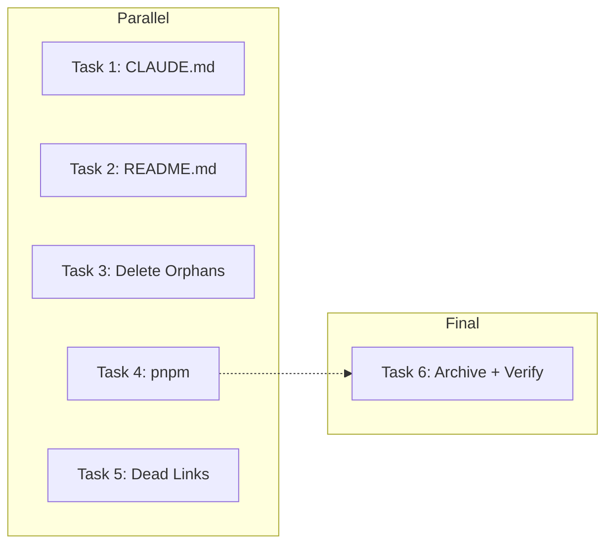

---json
{
  "type": "spec",
  "morgoth": "medium",
  "status": "draft",
  "domain": "full-stack",
  "name": "repo-structure-cleanup",
  "title": "Repository Structure Cleanup — Orphans, Phantom Refs, Stale Docs",
  "created": "2026-02-12",
  "updated": "2026-02-12"
}
---

# Morgoth Spec: Repository Structure Cleanup

## Problem

**Surface request:** Audit repo for unorganized files, phantom references, conflicting docs, and future-proofness.

**Root problem:** The repo evolved from a MYCURE-branded healthcare template to Dentalemon, but documentation, configuration, and file structure were never synchronized. CLAUDE.md contains 9+ false claims, 10 phantom routes are documented but don't exist, 7 navigation links point to 404s, ~1.8 MB of orphaned files exist, and the package manager is ambiguous.

**Who's affected:**
- **Developers** — CLAUDE.md gives wrong setup instructions (npm vs pnpm), wrong Next.js version (14 vs 16), wrong component count (47 vs 13)
- **Search engines / Users** — ProductHeader links to 7 non-existent routes
- **CI/CD** — dual lock files, dual next.config files create ambiguity
- **Future maintainers** — stale docs will compound confusion over time

**Impact:** Every new contributor will follow incorrect instructions. Dead files bloat the repo. Broken links degrade UX.

## Solution

Full structural cleanup in 6 tasks: (1) fix CLAUDE.md, (2) fix README.md, (3) delete orphaned files, (4) fix package manager to pnpm, (5) remove dead navigation links, (6) archive MYCURE guide. All tasks are independent and parallelizable.

## Scope Boundaries

**In scope:**
- Rewrite CLAUDE.md to match actual codebase state
- Update README.md to match
- Delete all orphaned/unused files
- Canonicalize pnpm as package manager
- Remove broken navigation links in ProductHeader.tsx
- Archive MYCURE guide to .docs/
- Add macOS resource forks to .gitignore
- Fix magicui barrel export

**Out of scope:**

| Item | Reason | Status |
|------|--------|--------|
| Creating the 10 missing routes | Not building template pages | Rejected |
| Removing unused npm dependencies from package.json | Separate task, needs testing | Deferred |
| Rewriting ProductHeader for 3-page site | Component may not even be rendered | Deferred |
| Removing unused brandConfig URL entries | Harmless, may be used later | Rejected |

## Assumptions

| Assumption | Impact if Wrong | Validation | Status |
|------------|-----------------|------------|--------|
| pnpm is the canonical package manager | Build scripts may break | User confirmed | ✅ |
| MYCURE guide should be archived not deleted | Could be deleted instead | User confirmed archive to .docs/ | ✅ |
| ProductHeader.tsx dead links should be removed | Links would stay broken | User confirmed removal | ✅ |
| Orphaned files have no hidden consumers | Deleting could break something | Verified via grep — zero references | ✅ |
| `package-lock.json` was created by our earlier `npm install` | May need to re-lock with pnpm | Check git status | ⏳ |

## Requirements

| Req# | Requirement | Priority | MoSCoW | Acceptance Criteria |
|------|-------------|----------|--------|---------------------|
| R1 | CLAUDE.md reflects actual codebase | P0 | Must | Every claim verified against code |
| R2 | No orphaned files in repo | P0 | Must | Zero unreferenced non-doc files |
| R3 | Single canonical package manager (pnpm) | P0 | Must | Only pnpm-lock.yaml, no package-lock.json |
| R4 | No broken navigation links | P0 | Must | All Link hrefs resolve to existing routes |
| R5 | .gitignore covers macOS artifacts | P1 | Should | `._*` pattern in .gitignore |
| R6 | README.md matches reality | P1 | Should | Routes, version, pkg manager correct |
| R7 | MYCURE guide archived | P2 | Could | File at .docs/archive/ |
| R8 | magicui barrel export complete | P2 | Could | sparkles-text exported from index |

## Tasks

### Task 1: Rewrite CLAUDE.md | AC: Every claim verified against code | Est: M

- [ ] 1.1: Update Next.js version from "14" to "16" in `CLAUDE.md` | AC: Version matches package.json
- [ ] 1.2: Update package manager from "npm" to "pnpm" in all dev commands in `CLAUDE.md` | AC: All commands use pnpm
- [ ] 1.3: Update component count from "47+" to actual count in `CLAUDE.md` | AC: Count matches `ls components/ui/*.tsx | wc -l`
- [ ] 1.4: Fix "Images are unoptimized" claim — images ARE optimized with AVIF/WebP in `CLAUDE.md` | AC: Matches next.config.mjs images config
- [ ] 1.5: Fix TypeScript/ESLint build claims in `CLAUDE.md` | AC: Matches actual next.config.mjs behavior
- [ ] 1.6: Remove all 10 phantom routes from Page Routes section in `CLAUDE.md` | AC: Only existing routes listed (/, /privacy-policy, /terms-and-conditions)
- [ ] 1.7: Remove references to `PAGE_LAYOUTS.md` and `COMPONENT_PATTERNS.md` in `CLAUDE.md` | AC: No references to non-existent .md files
- [ ] 1.8: Update Key Dependencies to only list actually-used deps in `CLAUDE.md` | AC: Every listed dep has ≥1 import in codebase
- [ ] 1.9: Remove Scrollytelling from Component Patterns in `CLAUDE.md` | AC: Only existing components listed

### Task 2: Update README.md | AC: README matches current project state | Est: S

- [ ] 2.1: Update Next.js version to 16 in `README.md` | AC: Version correct
- [ ] 2.2: Verify all pnpm commands are correct in `README.md` | AC: No npm/yarn references
- [ ] 2.3: Update page routes to only list existing routes in `README.md` | AC: Only 3 real routes listed
- [ ] 2.4: Update component count in `README.md` | AC: Matches actual count

### Task 3: Delete Orphaned Files | AC: Zero unreferenced non-doc files | Est: S

- [ ] 3.1: Delete `next.config.ts` (empty stub) | AC: Only next.config.mjs remains
- [ ] 3.2: Delete `playwright-inspection.js` and `playwright-navbar-analysis.js` | AC: No playwright scripts in root
- [ ] 3.3: Delete `public/Koalas/` directory (3 unreferenced images) | AC: Directory gone
- [ ] 3.4: Delete `public/dentalemon-ui-prepped.png` (unused — .webp version is used) | AC: Only .webp remains
- [ ] 3.5: Delete `public/dentalemon-ui-prepped-mobile.webp` (unreferenced) | AC: File gone
- [ ] 3.6: Delete `app/dentalemon_favicon.ico` (identical duplicate of favicon.ico) | AC: Only favicon.ico remains
- [ ] 3.7: Delete `styles/design-system.ts` (zero imports) | AC: File gone
- [ ] 3.8: Delete all macOS `._*` resource fork files | AC: No `._*` files in repo
- [ ] 3.9: Delete unused image variants: `public/features/effortless-clinical-workflows.png`, `public/features/effortless-clinical-workflows-v2.png`, `public/features/philhealth-accreditation.png` | AC: Only `-v3` and `-v2` variants that are actually imported remain
- [ ] 3.10: Consolidate `public/Features Photos/` into `public/features/` then delete `Features Photos/` | AC: Single features directory, no duplicate assets

### Task 4: Canonicalize pnpm | AC: pnpm is sole package manager | Est: S

- [ ] 4.1: Delete `package-lock.json` if it exists | AC: No package-lock.json in repo
- [ ] 4.2: Run `pnpm install` to ensure pnpm-lock.yaml is up to date | AC: pnpm install succeeds
- [ ] 4.3: Add `"packageManager"` field to `package.json` | AC: Field specifies pnpm version
- [ ] 4.4: Verify `pnpm run build` succeeds | AC: Build exit code 0

### Task 5: Fix Broken Navigation Links | AC: No Link hrefs to non-existent routes | Est: S

- [ ] 5.1: Remove dead route links from `components/sections/product-page/ProductHeader.tsx` (lines with /booking, /telehealth, /clinics, /corporate, /skin, /diagnostics, /mobile-labs) | AC: No links to non-existent routes
- [ ] 5.2: Search entire codebase for any other Link href or anchor to phantom routes | AC: Zero references to /clinics, /diagnostics, /telehealth, /booking, /download, /skin, /corporate, /mobile-labs, /our-story, /syncbase-technology

### Task 6: Archive & Housekeeping | AC: Repo structure is clean | Est: S

- [ ] 6.1: Create `.docs/archive/` directory and move `MYCURE_Design_System_Adaptation_Guide.md` there | AC: File at .docs/archive/, not in root
- [ ] 6.2: Add `._*` pattern to `.gitignore` | AC: macOS resource forks excluded
- [ ] 6.3: Add `export * from "./sparkles-text"` to `components/magicui/index.ts` | AC: All magicui components exported from barrel
- [ ] 6.4: Run `pnpm run build` to verify nothing broke | AC: Build succeeds, all 9 pages generated

## Dependencies

| Task | Depends On | Blocks | Type |
|------|------------|--------|------|
| 1 (CLAUDE.md) | — | — | Independent |
| 2 (README.md) | — | — | Independent |
| 3 (Orphans) | — | — | Independent |
| 4 (pnpm) | — | 6 | Soft (build verification) |
| 5 (Dead links) | — | — | Independent |
| 6 (Housekeeping) | 4 | — | Soft (needs pnpm for build) |

## Estimation Summary

| Task | Size | Time Est |
|------|------|----------|
| 1. CLAUDE.md rewrite | M | 20 min |
| 2. README.md update | S | 10 min |
| 3. Delete orphans | S | 10 min |
| 4. Canonicalize pnpm | S | 5 min |
| 5. Fix dead links | S | 10 min |
| 6. Archive + verify | S | 10 min |
| **Total** | — | **~65 min** |

## Risks

| Risk | Likelihood | Impact | Mitigation |
|------|------------|--------|------------|
| Deleting files that ARE used via dynamic import | Low | High | All deletions verified via grep — zero refs found |
| pnpm-lock.yaml out of sync after npm install | Medium | Medium | Run `pnpm install` to regenerate |
| ProductHeader removal breaks a page | Low | Medium | Verify component isn't rendered on any existing route |
| Features Photos/ consolidation breaks image paths | Medium | Medium | Grep all image paths before moving |

## Test Requirements

- [ ] **Build test**: Run `pnpm run build` — exit code 0, all pages generated | AC: 9 routes in output
- [ ] **Link audit**: Grep for all phantom route names — zero results | AC: No `/clinics`, `/diagnostics`, etc.
- [ ] **File audit**: Verify deleted files are gone | AC: `ls` confirms removal
- [ ] **CLAUDE.md spot-check**: Verify 3 random claims match code | AC: All 3 accurate

## References

| Resource | Type | Path | Relevance |
|----------|------|------|-----------|
| CLAUDE.md | Doc | `CLAUDE.md` | Primary rewrite target |
| README.md | Doc | `README.md` | Secondary update target |
| Brand config | Config | `config/brand.ts` | Source of truth for URLs, company info |
| Next config | Config | `next.config.mjs` | Source of truth for build behavior |
| Package.json | Config | `package.json` | Source of truth for deps and scripts |
| ProductHeader | Component | `components/sections/product-page/ProductHeader.tsx` | Dead link removal target |
| Magicui barrel | Index | `components/magicui/index.ts` | Missing export fix |
| MYCURE guide | Doc | `MYCURE_Design_System_Adaptation_Guide.md` | Archive target |
